### Task 0: Install a ubuntu 16.04 server 64-bit

Virtual Machine Settings

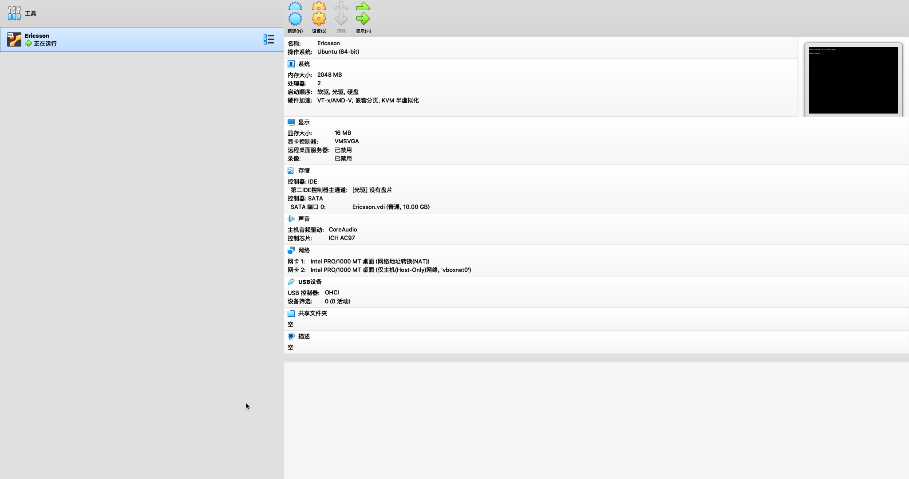

for VM, use NAT network and forward required ports to host machine

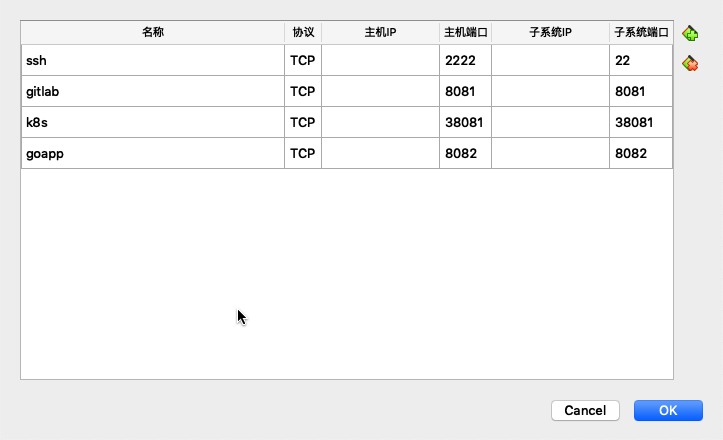

### Task 1: Update system

ssh to guest machine from host machine ($ ssh user@localhost -p 2222) and update the system to the latest

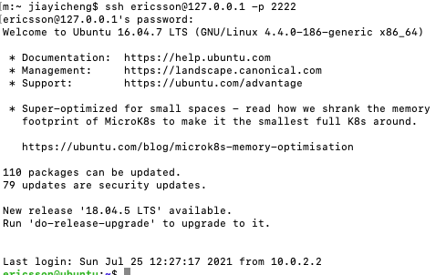

### Task 2: install gitlab-ce version in the host
Expect output: Gitlab is up and running at http://127.0.0.1 (no tls or FQDN required)

Access it from host machine http://127.0.0.1:8081

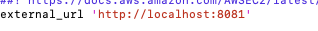

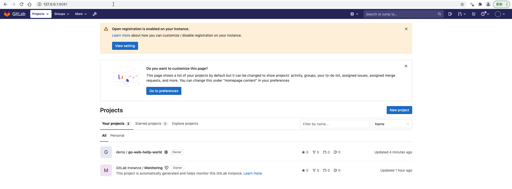

### Task 3: create a demo group/project in gitlab

named demo/go-web-hello-world (demo is group name, go-web-hello-world is project name).

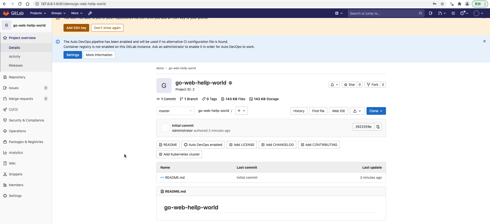

Use golang to build a hello world web app (listen to 8081 port) and check-in the code to mainline.

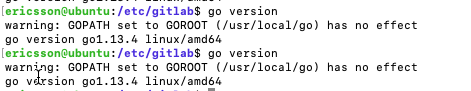


Expect source code at http://127.0.0.1:8081/demo/go-web-hellp-world

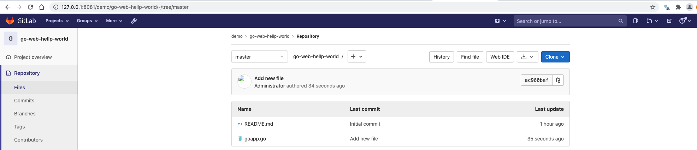

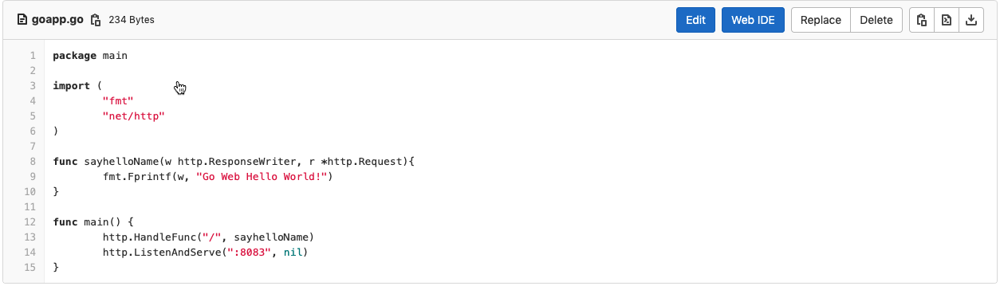


### Task 4: build the app and expose ($ go run) the service to 8081 port

Expect output: 

```
curl http://127.0.0.1:8083
Go Web Hello World!
```

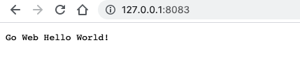

### Task 5: install docker

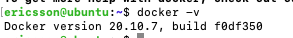


### Task 6: run the app in container

build a docker image ($ docker build) for the web app and run that in a container ($ docker run), expose the service to 8083 (-p)

Check in the Dockerfile into gitlab

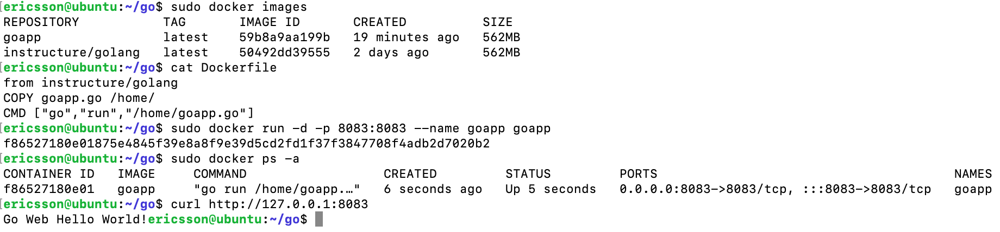

### Task 7: push image to dockerhubni

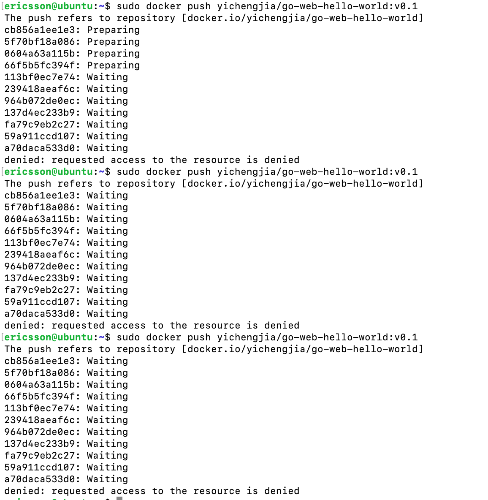

I don't know why denied.

### Task 8: document the procedure in a MarkDown file

create a README.md file in the gitlab repo and add the technical procedure above (0-7) in this file

-----------------------------------

### Task 9: publish your work

push all files/procedures in your local gitlab repo to remote github repo (e.g. https://github.com/your_github_id/go-web-hello-world)

